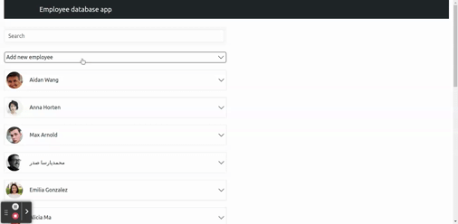

# Simple employee list with edit and delete operations.
1. Small React app to manage Employee list.  
2. You can view the list of employees.  
3. Data fetch from JSON. 
4. Search with debounce action integrated in search box. 
5. react-bootstrap integrated for accordion and other UI elements.  
6. Create, edit & Delete employee.  
7. Mark todo as favourite. 

## Live app on stackblitz 
[https://stackblitz.com/edit/react-bootstrap-crud-operations?file=src%2FApp.js](https://stackblitz.com/edit/react-bootstrap-crud-operations?file=src%2FApp.js)

# Kickstart
1. checkout the repository
2. cd app
3. npm install
4. npm start

## Demo - add new employee

## Demo - edit/delete and search functions

